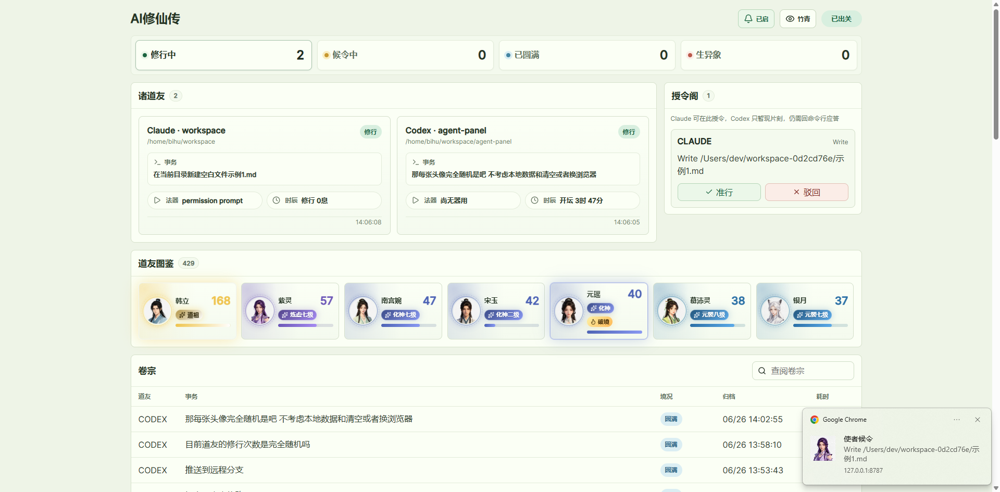

# AI修仙传

本地 AI 编程 Agent 看板。它监控 Claude Code 和 Codex CLI 会话，接收 Hook 事件，展示修行状态、待授权、任务卷宗和通知图鉴，并可在浏览器中处理 Claude 授权请求。

## Features

- 监控 Claude Code、Codex CLI 进程和 Hook 事件
- 实时状态看板：修行、候令、待言、圆满、异象、坐化
- 授令阁：集中展示授权请求，Claude 可在 Web UI 里准行/驳回
- 卷宗：保存近期任务历史，支持搜索、分页、会话精确筛选、详情查看、恢复命令复制和会话删除
- 道友图鉴：统计通知头像使用次数，按修仙境界升级，并支持折叠展示
- 浏览器通知：任务圆满、任务异常、等待输入、待授权，支持传音/静默提示音切换
- 三套主题：宣纸、夜墨、竹青
- SQLite 本地存储
- 可选 API Token 保护
- 支持 WSL2 场景下发现 Windows 进程

## Interface Overview



```text
AI修仙传
顶部状态概览：修行中 / 候令中 / 已圆满 / 生异象
诸道友 / 授令阁 / 道友图鉴 / 卷宗
```

## Requirements

- Node.js 22+ recommended
- npm
- Claude Code CLI, optional
- Codex CLI, optional

`node:sqlite` is used by the server, so older Node.js versions may not work.

## Quick Start

```bash
npm install
npm run build
npm start
```

Open:

```text
http://127.0.0.1:8787
```

Install hooks:

```bash
npm run hooks:install
```

Start a Claude or Codex session. The dashboard updates automatically.

## Scripts

| Command | Description |
|---|---|
| `npm run dev` | Start server and Vite web dev server |
| `npm run build` | Build shared types, server, and web |
| `npm run typecheck` | Type-check server and web |
| `npm start` | Start built production server |
| `npm run restart` | Build, stop existing local service on the port, restart in background |
| `npm run hooks:install` | Install Claude/Codex hooks |
| `npm run hooks:uninstall` | Remove installed hooks |

## Development

```bash
npm install
npm run dev
```

Default dev endpoints:

- Web: `http://127.0.0.1:5173`
- API: `http://127.0.0.1:8787`

Before pushing:

```bash
npm run typecheck
npm run build
```

## Production Run

```bash
npm run build
npm start
```

Restart in background:

```bash
npm run restart
```

Custom port:

```bash
AGENT_MONITOR_PORT=8789 npm run restart
```

Logs:

```bash
tail -f app.log
```

PID files are written under `.agent-monitor/`, one per port.

## Configuration

Copy `.env.example` if you want local defaults:

```bash
cp .env.example .env
```

Environment variables:

| Variable | Default | Description |
|---|---:|---|
| `AGENT_MONITOR_HOST` | `127.0.0.1` | Server bind host |
| `AGENT_MONITOR_PORT` | `8787` | Server port |
| `AGENT_MONITOR_TOKEN` | empty | Optional bearer token for API, WebSocket, hooks |
| `AGENT_MONITOR_DATA_DIR` | `.agent-monitor` | SQLite and PID data directory |
| `AGENT_MONITOR_POLL_MS` | `2500` | Discovery polling interval |
| `AGENT_MONITOR_HISTORY_DAYS` | `14` | Retention for history/events/resolved approvals |
| `AGENT_MONITOR_APPROVAL_TIMEOUT_MS` | `570000` | Claude permission request timeout |
| `AGENT_MONITOR_CODEX_APPROVAL_TTL_MS` | `120000` | Codex pending approval display TTL |
| `AGENT_MONITOR_WINDOWS_PS` | `1` | Enable Windows process discovery from WSL2 |
| `AGENT_MONITOR_WINDOWS_PS_CACHE_MS` | `10000` | Windows process discovery cache |
| `VITE_API_BASE` | `http://127.0.0.1:8787` | Web client API base at build/dev time |
| `VITE_AGENT_MONITOR_TOKEN` | empty | Web client token at build/dev time |

History, event, and resolved approval records are retained for 14 days by default.

Token example:

```bash
AGENT_MONITOR_TOKEN=change-me VITE_AGENT_MONITOR_TOKEN=change-me npm run build
AGENT_MONITOR_TOKEN=change-me npm start
AGENT_MONITOR_TOKEN=change-me npm run hooks:install
```

## Hooks

Hooks forward CLI lifecycle events to:

- `POST /api/hooks/claude`
- `POST /api/hooks/codex`

Install:

```bash
npm run hooks:install
```

Install with explicit URL:

```bash
AGENT_MONITOR_URL=http://127.0.0.1:8787 npm run hooks:install
```

Uninstall:

```bash
npm run hooks:uninstall
```

Files modified:

- `~/.claude/settings.json`
- `~/.codex/hooks.json`

Backups:

- `~/.claude/settings.json.agent-monitor.bak`
- `~/.codex/hooks.json.agent-monitor.bak`

Claude hook events:

- `PermissionRequest`
- `PreToolUse`
- `PostToolUse`
- `PostToolUseFailure`
- `Notification`
- `Stop`
- `StopFailure`
- `SessionEnd`

Codex hook events:

- `PermissionRequest`
- `PreToolUse`
- `PostToolUse`
- `UserPromptSubmit`
- `Stop`
- `SubagentStop`

## UI Guide

### 顶部状态概览

- `修行中`: running agents
- `候令中`: actionable approvals plus waiting approval/input agents
- `已圆满`: finished task history for today
- `生异象`: error task history for today
- `已出关`: WebSocket connected
- `闭关中`: WebSocket disconnected

### 诸道友

Shows active agents with:

- provider/workspace name
- current state
- cwd or PID
- task
- current tool or waiting reason
- active/session duration
- last update time

If an agent is already represented in 授令阁, the duplicate waiting card is hidden.

### 授令阁

Shows pending approvals.

- Claude: approve/reject in the browser; the decision is returned to the live `PermissionRequest` hook
- Codex: displayed as observed pending state; answer in the CLI when required

Codex entries auto-expire after `AGENT_MONITOR_CODEX_APPROVAL_TTL_MS`, or resolve locally when matching tool completion is observed.

### 道友图鉴

Browser notifications randomly use one of the bundled avatars. The selected avatar gets one use count, stored in browser `localStorage`.

The atlas can be collapsed from its header. The display preference is stored locally.

The top-right `传音/静默` control toggles a short notification sound for browser notification cards.

Cultivation ranks:

```text
炼气、筑基、结丹、元婴、化神、炼虚、合体、大乘、真仙、金仙、太乙、大罗、道祖
```

Upgrade rule:

- Every 10 notifications advances to the next rank
- Example: `炼气九级` -> `筑基`
- Highest rank is `道祖`
- Original avatar preview unlocks at 10 uses

### 卷宗

Task history table:

- 道友: provider
- 事务: prompt/result summary, with copy task and copy resume command actions
- 境况: final state
- 归档: end time
- 耗时: duration

Search filters task, provider, session id, agent id, final status, and result summary.

Row actions:

- View detail: open a drawer with full result summary, session metadata, resume command, and event timeline
- Copy task: copy the prompt/result summary used for display
- Copy resume command: copy `claude --resume ...` or `codex resume ...` when available
- Session history: filter history by exact session id while keeping the current provider filter
- Delete session: remove all task history and events for the session after confirmation

## Data Storage

Default data directory:

```text
.agent-monitor/
```

SQLite file:

```text
.agent-monitor/agent-monitor.sqlite
```

Stored data:

- agent snapshots
- raw hook/discovery events
- approval requests
- task history

Change data directory:

```bash
AGENT_MONITOR_DATA_DIR=/path/to/data npm start
```

Reset local data:

```bash
rm -rf .agent-monitor
```

## API

### Snapshot

```http
GET /api/snapshot?search=&limit=50&offset=0&provider=all&sessionId=
```

### History Detail

```http
GET /api/history/:id
```

### History Deletion

```http
DELETE /api/history/:id
DELETE /api/history/session?sessionId=...
```

### Hook Ingest

```http
POST /api/hooks/claude
POST /api/hooks/codex
```

### Approval Resolution

```http
POST /api/approvals/:id/approve
POST /api/approvals/:id/reject
```

### WebSocket

```text
ws://127.0.0.1:8787/ws
```

Message types:

- `snapshot`
- `agent`
- `approval`
- `history`
- `error`

When `AGENT_MONITOR_TOKEN` is set, pass it as:

- `Authorization: Bearer <token>`
- `?token=<token>`

## WSL2

When the server runs in WSL2, Windows process discovery can query `powershell.exe` or `pwsh.exe`.

Enable:

```bash
AGENT_MONITOR_WINDOWS_PS=1 npm start
```

Disable:

```bash
AGENT_MONITOR_WINDOWS_PS=0 npm start
```

## Troubleshooting

### Dashboard Shows No Agents

```bash
npm start
npm run hooks:install
```

Then restart a Claude/Codex session.

### Hooks Do Not Send Events

Reinstall hooks with the exact running URL:

```bash
AGENT_MONITOR_URL=http://127.0.0.1:8787 npm run hooks:install
```

If token is enabled:

```bash
AGENT_MONITOR_TOKEN=change-me AGENT_MONITOR_URL=http://127.0.0.1:8787 npm run hooks:install
```

### Browser Cannot Connect

Check host and port:

```bash
AGENT_MONITOR_HOST=127.0.0.1 AGENT_MONITOR_PORT=8787 npm start
```

For Vite dev:

```bash
VITE_API_BASE=http://127.0.0.1:8787 npm run dev
```

### Notifications Do Not Work

Click the bell button and allow browser notifications. If denied, change the browser site notification permission.

### Port Already In Use

```bash
ss -ltnp | grep ':8787'
```

Then stop the listed PID or use another port:

```bash
AGENT_MONITOR_PORT=8789 npm start
```

## Repository Hygiene

Do not commit:

- `node_modules/`
- `apps/*/dist/`
- `packages/shared/dist/`
- `.agent-monitor/`
- `.env`
- logs and PID files

These are covered by `.gitignore`.

## Limitations

- Codex approval handling is display-oriented; answer in the CLI when Codex requires interaction
- Claude foreground sessions need hooks for precise lifecycle updates
- Browser notifications require browser permission and support
- This project is intended for local development use; set a token before exposing it beyond localhost

## License

MIT
