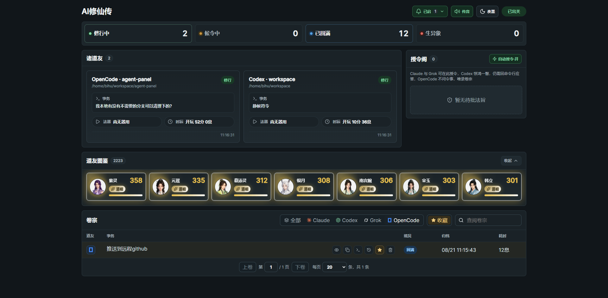

# AI修仙传

本地 AI 编程 Agent 看板。它监控 Claude Code、Codex CLI 和 Grok CLI 会话，接收 Hook 事件，展示修行状态、待授权、任务卷宗和通知图鉴，并可在浏览器中处理 Claude 和 Grok 授权请求。

## Features

- 监控 Claude Code、Codex CLI、Grok CLI 进程和 Hook 事件
- 实时状态看板：修行、候令、待言、圆满、异象、坐化
- 授令阁：集中展示授权请求，Claude 与 Grok 可在 Web UI 里准行/驳回
- 自动授令：可选开关，开启后自动准行 Claude 与 Grok 的授权请求（有风险，见 UI Guide 说明）
- 卷宗：保存近期任务历史，支持搜索、分页、来源筛选、收藏筛选、会话精确筛选、详情查看、恢复命令复制和会话删除
- 道友图鉴：统计通知头像使用次数，按修仙境界升级，并支持折叠展示
- 浏览器通知：任务圆满、任务异常、等待输入、待授权，四类可分别开关，支持传音/静默提示音切换
- 三套主题：宣纸、夜墨、竹青
- SQLite 本地存储
- 可选 API Token 保护
- 支持 WSL2 场景下发现 Windows 进程

## Interface Overview



```text
AI修仙传
顶部状态概览：修行中 / 候令中 / 已圆满 / 生异象
诸道友 / 授令阁 / 道友图鉴 / 卷宗
```

## Requirements

- Node.js 22+ recommended
- npm
- Claude Code CLI, optional
- Codex CLI, optional
- Grok CLI, optional

`node:sqlite` is used by the server, so older Node.js versions may not work.

## Quick Start

```bash
npm install
npm run build
npm start
```

Open:

```text
http://127.0.0.1:8787
```

Install hooks:

```bash
npm run hooks:install
```

Start a Claude, Codex, or Grok session. The dashboard updates automatically.

## Scripts

| Command | Description |
|---|---|
| `npm run dev` | Start server and Vite web dev server |
| `npm run build` | Build shared types, server, and web |
| `npm run typecheck` | Type-check server and web |
| `npm start` | Start built production server |
| `npm run restart` | Build, stop existing local service on the port, restart in background |
| `npm run hooks:install` | Install Claude/Codex/Grok hooks |
| `npm run hooks:uninstall` | Remove installed hooks |

## Development

```bash
npm install
npm run dev
```

Default dev endpoints:

- Web: `http://127.0.0.1:5173`
- API: `http://127.0.0.1:8787`

Before pushing:

```bash
npm run typecheck
npm run build
```

## Production Run

```bash
npm run build
npm start
```

Restart in background:

```bash
npm run restart
```

Custom port:

```bash
AGENT_MONITOR_PORT=8789 npm run restart
```

Logs:

```bash
tail -f app.log
```

PID files are written under `.agent-monitor/`, one per port.

## Configuration

Copy `.env.example` if you want local defaults:

```bash
cp .env.example .env
```

Environment variables:

| Variable | Default | Description |
|---|---:|---|
| `AGENT_MONITOR_HOST` | `127.0.0.1` | Server bind host |
| `AGENT_MONITOR_PORT` | `8787` | Server port |
| `AGENT_MONITOR_TOKEN` | empty | Optional bearer token for API, WebSocket, hooks |
| `AGENT_MONITOR_DATA_DIR` | `.agent-monitor` | SQLite and PID data directory |
| `AGENT_MONITOR_POLL_MS` | `2500` | Discovery polling interval |
| `AGENT_MONITOR_HISTORY_DAYS` | `14` | Retention in days for history/events/resolved approvals; older rows are **deleted permanently**, `<= 0` keeps everything |
| `AGENT_MONITOR_APPROVAL_TIMEOUT_MS` | `570000` | Claude permission request timeout |
| `AGENT_MONITOR_CODEX_APPROVAL_TTL_MS` | `120000` | Codex/Grok pending approval display TTL |
| `AGENT_MONITOR_GROK_APPROVAL_TOOLS` | `^(run_terminal_cmd\|run_terminal_command\|search_replace\|apply_patch\|write_file)$` | Regex of grok tool names gated as approvals via PreToolUse; empty disables grok approvals (monitor-only) |
| `AGENT_MONITOR_WINDOWS_PS` | `1` | Enable Windows process discovery from WSL2 |
| `AGENT_MONITOR_WINDOWS_PS_CACHE_MS` | `10000` | Windows process discovery cache |
| `VITE_API_BASE` | `http://127.0.0.1:8787` | Web client API base at build/dev time |
| `VITE_AGENT_MONITOR_TOKEN` | empty | Web client token at build/dev time |

### Data retention

> **Cleanup deletes rows permanently, and it starts as soon as the server boots.** Records older than
> `AGENT_MONITOR_HISTORY_DAYS` are removed at startup and then once an hour. Lowering the value and
> restarting deletes everything outside the new window immediately — for example switching from `14`
> to `3` drops days 4-14 on the next start. There is no undo and no backup; copy
> `.agent-monitor/agent-monitor.sqlite` first if you need those records.

The default window is 14 days. Set `AGENT_MONITOR_HISTORY_DAYS` to `0` (or any negative number) to
disable cleanup entirely and keep everything permanently.

What each run deletes:

| Data | Deleted when older than the window |
|---|---|
| Task history | Yes, except favorited entries and tasks that have not ended |
| Agent events | Yes |
| Approval requests | Yes, only resolved ones; pending requests are kept |
| Agents | Never cleaned up |

Favorite a history entry in the panel to exempt it from cleanup — favorites survive regardless of age.
Note that SQLite does not shrink the database file on delete; the freed space is reused by later writes.
Run `VACUUM` manually with the server stopped if you need the file itself to get smaller.

Token example:

```bash
AGENT_MONITOR_TOKEN=change-me VITE_AGENT_MONITOR_TOKEN=change-me npm run build
AGENT_MONITOR_TOKEN=change-me npm start
AGENT_MONITOR_TOKEN=change-me npm run hooks:install
```

## Hooks

Hooks forward CLI lifecycle events to:

- `POST /api/hooks/claude`
- `POST /api/hooks/codex`
- `POST /api/hooks/grok`

Install:

```bash
npm run hooks:install
```

Install with explicit URL:

```bash
AGENT_MONITOR_URL=http://127.0.0.1:8787 npm run hooks:install
```

Uninstall:

```bash
npm run hooks:uninstall
```

Files modified:

- `~/.claude/settings.json`
- `~/.codex/hooks.json`
- `~/.grok/hooks/agent-monitor.json`

Backups:

- `~/.claude/settings.json.agent-monitor.bak`
- `~/.codex/hooks.json.agent-monitor.bak`
- `~/.grok/hooks/agent-monitor.json.agent-monitor.bak`

Claude hook events:

- `PermissionRequest`
- `PreToolUse`
- `PostToolUse`
- `PostToolUseFailure`
- `Notification`
- `UserPromptSubmit`
- `Stop`
- `StopFailure`
- `SessionEnd`

Codex hook events:

- `PermissionRequest`
- `PreToolUse`
- `PostToolUse`
- `UserPromptSubmit`
- `Stop`
- `SubagentStop`

Grok hook events (grok normalizes event names to snake_case at runtime):

- `UserPromptSubmit`
- `PreToolUse` (approval gate; risky tools are surfaced as approvals, see `AGENT_MONITOR_GROK_APPROVAL_TOOLS`)
- `PostToolUse`
- `PostToolUseFailure`
- `Notification`
- `Stop`
- `StopFailure`
- `SessionEnd`

Grok has no dedicated permission hook, so approvals are gated through `PreToolUse`: the panel returns a top-level `{"decision":"deny"}` to block a rejected/timed-out tool, and `{"decision":"allow"}` on approve. Because grok also executes hooks from `~/.claude/settings.json`, the forwarder tags events by the `GROK_HOOK_EVENT` marker so grok turns are never mislabeled as Claude.

## UI Guide

### 顶部状态概览

- `修行中`: running agents
- `候令中`: actionable approvals plus waiting approval/input agents
- `已圆满`: finished task history for today
- `生异象`: error task history for today
- `已出关`: WebSocket connected
- `闭关中`: WebSocket disconnected

顶部右侧三个控件：铃铛按钮展开弹窗提醒设置（见 [弹窗提醒设置](#弹窗提醒设置)），`传音/静默` 切换提示音，主题按钮循环三套配色。

### 诸道友

Shows active agents with:

- provider/workspace name
- current state
- cwd or PID
- task
- current tool or waiting reason
- active/session duration
- last update time

If an agent is already represented in 授令阁, the duplicate waiting card is hidden.

Cards track live processes only. A session that exits stops being shown, including a background session that dies without reporting a terminal state — without a live pid there is nothing left to confirm it is running. Rows left behind by exited processes are pruned when the server starts.

### 授令阁

Shows pending approvals.

- Claude: approve/reject in the browser; the decision is returned to the live `PermissionRequest` hook
- Grok: approve/reject in the browser; the decision is returned to the live `PreToolUse` hook as a top-level allow/deny
- Codex: displayed as observed pending state; answer in the CLI when required

Codex and Grok entries auto-expire after `AGENT_MONITOR_CODEX_APPROVAL_TTL_MS`, or resolve locally when matching tool completion is observed.

#### 自动授令

授令阁标题栏提供 `自动授令` 开关。开启后，所有可操作的 Claude 与 Grok 待批法旨会被自动准行，等同于逐条点击 `准行`，无需人工干预。

- 对 Claude 与 Grok 授权请求生效，Codex 仍需回命令行应答
- 开启开关的瞬间，当前已挂起的待批法旨会被立即批准，而不只是之后新到的
- 开关状态保存在浏览器 `localStorage`，刷新页面后保持，默认关闭

> **⚠️ 风险提示**
>
> 自动授令会跳过人工审查，无差别批准 Claude 与 Grok 发起的所有权限请求，包括执行任意 Shell 命令、读写与删除文件、访问网络等敏感操作。这相当于给 Agent 放开了权限闸门，Agent 的误操作或非预期行为将不再有人工拦截的机会。
>
> 建议仅在受控环境（如隔离的开发容器、可随时回滚的沙箱、无重要数据的实验目录）中开启，并保持看板处于可见状态以便随时关闭。**开启自动授令即表示你已知晓上述风险，由此产生的一切后果由使用者自行承担。**

### 道友图鉴

Browser notifications randomly use one of the bundled avatars. The selected avatar gets one use count, stored in browser `localStorage`.

The atlas can be collapsed from its header. The display preference is stored locally.

The top-right `传音/静默` control toggles a short notification sound for browser notification cards.

### 弹窗提醒设置

The top-right bell button opens a panel that switches each notification category on or off:

| 类别 | 触发时机 |
| --- | --- |
| `待授令` | An approval request is pending |
| `事务圆满` | A task finished successfully |
| `事务异象` | A task ended with an error |
| `待传言` | An agent is waiting for input |

All four default to on, so the behaviour matches earlier versions until you change something. The choice is stored in browser `localStorage` and applies immediately, with no reload needed. A muted category also loses its notification sound, while the global `传音/静默` control keeps working independently.

Muting `待授令` only stops the system notification card. 授令阁 still lists pending approvals, because that panel is the only place to approve Claude and Grok requests.

The panel footer shows the current browser permission state. Notifications only appear when the browser has granted permission, whatever these switches say.

Cultivation ranks:

```text
炼气、筑基、结丹、元婴、化神、炼虚、合体、大乘、真仙、金仙、太乙、大罗、道祖
```

Upgrade rule:

- Every 10 notifications advances to the next rank
- Example: `炼气九级` -> `筑基`
- Highest rank is `道祖`
- Original avatar preview unlocks at 10 uses

### 卷宗

Task history table:

- 道友: provider
- 事务: prompt/result summary, with copy task and copy resume command actions
- 境况: final state
- 归档: end time
- 耗时: duration

Toolbar filters:

- Provider filter: single-select among `全部` / `Claude` / `Codex` / `Grok`
- Favorite filter: independent toggle between the provider filter and search box; when active, only favorited history rows are queried
- Search: filters task, provider, session id, agent id, final status, and result summary

Provider, favorite, search, session, and pagination filters can be combined. Favorite state is stored in SQLite and survives refresh.

Row actions:

- View detail: open a drawer with full result summary, session metadata, resume command, and event timeline
- Copy task: copy the prompt/result summary used for display
- Copy resume command: copy `claude --resume ...`, `codex resume ...`, or `grok --resume ...` when available
- Session history: filter history by exact session id while keeping the current provider filter
- Favorite / unfavorite: star toggle at the end of the action group; persists `favorited` on the history row
- Delete session: remove all task history and events for the session after confirmation

## Data Storage

Default data directory:

```text
.agent-monitor/
```

SQLite file:

```text
.agent-monitor/agent-monitor.sqlite
```

Stored data:

- agent snapshots
- raw hook/discovery events
- approval requests
- task history, including favorite flags

Agent snapshot rows belong to a process. On startup the server deletes the ones whose pid no longer exists, so a long-running database does not accumulate an entry per session that ever ran. Task history is stored separately and this cleanup never touches it.

Change data directory:

```bash
AGENT_MONITOR_DATA_DIR=/path/to/data npm start
```

Reset local data:

```bash
rm -rf .agent-monitor
```

## API

### Snapshot

```http
GET /api/snapshot?search=&limit=50&offset=0&provider=all&sessionId=&favorites=0
```

Query notes:

- `provider`: `all` | `claude` | `codex` | `grok`
- `favorites=1`: only return favorited history rows
- `sessionId`: exact session filter via `provider_instance_id`

### History Detail

```http
GET /api/history/:id
```

### History Favorite

```http
POST /api/history/:id/favorite?favorited=1
POST /api/history/:id/favorite?favorited=0
```

Toggles favorite state on a history row and broadcasts the updated history item over WebSocket.

### History Deletion

```http
DELETE /api/history/:id
DELETE /api/history/session?sessionId=...
```

### Hook Ingest

```http
POST /api/hooks/claude
POST /api/hooks/codex
POST /api/hooks/grok
```

### Approval Resolution

```http
POST /api/approvals/:id/approve
POST /api/approvals/:id/reject
```

### WebSocket

```text
ws://127.0.0.1:8787/ws
```

Message types:

- `snapshot`
- `agent`
- `approval`
- `history`
- `error`

When `AGENT_MONITOR_TOKEN` is set, pass it as:

- `Authorization: Bearer <token>`
- `?token=<token>`

## WSL2

When the server runs in WSL2, Windows process discovery can query `powershell.exe` or `pwsh.exe`.

Enable:

```bash
AGENT_MONITOR_WINDOWS_PS=1 npm start
```

Disable:

```bash
AGENT_MONITOR_WINDOWS_PS=0 npm start
```

## Troubleshooting

### Dashboard Shows No Agents

```bash
npm start
npm run hooks:install
```

Then restart a Claude/Codex/Grok session.

### Dashboard Shows Sessions That Already Exited

Restart the server, which prunes agent rows whose process is gone:

```bash
npm run restart
```

Background agents are the usual source. When one dies it can stay in `claude agents --json --all` in a non-terminal state with no pid, so compare that list against the real processes:

```bash
claude agents --json --all
ps -eo pid,args | grep claude | grep -v grep
```

### Hooks Do Not Send Events

Reinstall hooks with the exact running URL:

```bash
AGENT_MONITOR_URL=http://127.0.0.1:8787 npm run hooks:install
```

If token is enabled:

```bash
AGENT_MONITOR_TOKEN=change-me AGENT_MONITOR_URL=http://127.0.0.1:8787 npm run hooks:install
```

### Browser Cannot Connect

Check host and port:

```bash
AGENT_MONITOR_HOST=127.0.0.1 AGENT_MONITOR_PORT=8787 npm start
```

For Vite dev:

```bash
VITE_API_BASE=http://127.0.0.1:8787 npm run dev
```

### Notifications Do Not Work

Click the bell button and allow browser notifications. If denied, change the browser site notification permission.

### Port Already In Use

```bash
ss -ltnp | grep ':8787'
```

Then stop the listed PID or use another port:

```bash
AGENT_MONITOR_PORT=8789 npm start
```

## Repository Hygiene

Do not commit:

- `node_modules/`
- `apps/*/dist/`
- `packages/shared/dist/`
- `.agent-monitor/`
- `.env`
- logs and PID files

These are covered by `.gitignore`.

## Limitations

- Codex approval handling is display-oriented; answer in the CLI when Codex requires interaction
- Grok approvals gate through `PreToolUse`: panel reject is a hard deny, but panel approve only falls through to grok's own permission rules (the TUI may still prompt); for remote-only approval run grok with `--always-approve` or allow rules and let the panel be the gate. Hook timeouts fail open on grok's side
- Claude foreground sessions need hooks for precise lifecycle updates
- Browser notifications require browser permission and support
- This project is intended for local development use; set a token before exposing it beyond localhost

## License

MIT
